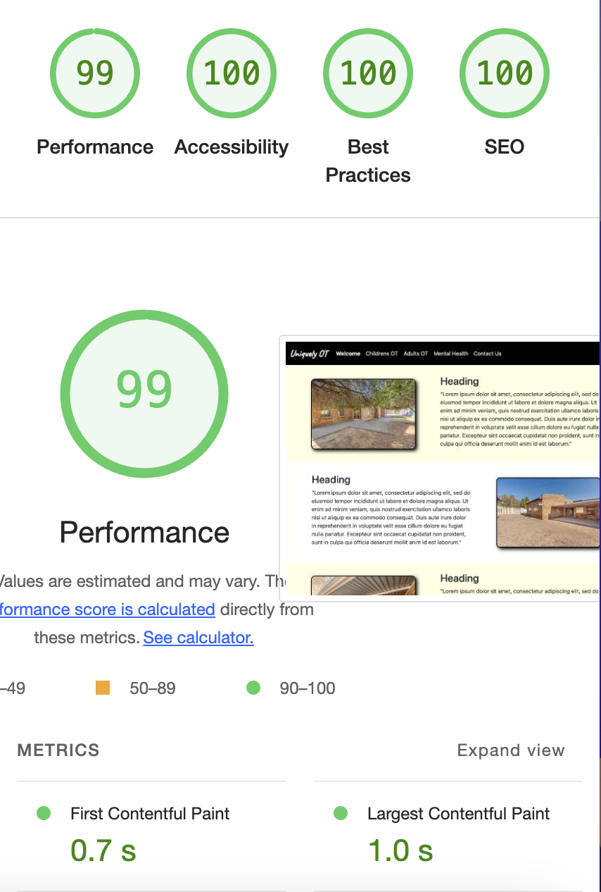

# Uniquely Occupational Therapy

** UNDER CONSTRUCTION **

A website build for an Occupational Therapy and Mental Health business based in South Africa. 
The code is subject to copyright and is not not to be used without the express permission of
the author, 4uxdesign. The images are also subject to copyright and are not to be used without the express permission of the author.

## Performance and Testing

Google Lighthouse Testing before deployment.

## Technologies

[Bootstrap5.3](https://getbootstrap.com/) - CSS and Javascript library

[convertio.co](https://convertio.co/) - convert images to webp format

[favicon.io](https://favicon.io/) - favicon image creator

## Acknowledgements

[Footer that sticks to bottom of content/screen](https://dev.to/nehalahmadkhan/how-to-make-footer-stick-to-bottom-of-web-page-3i14) - Thanks to Nehal Ahmad

[Stackoverflow](https://stackoverflow.com/questions/71813422/how-would-i-make-a-transition-for-the-div-to-slide-to-the-left-and-come-out-thro) - Adapted to provide a single sliding div from right to left

[Flaticon](https://www.flaticon.com/) - Free icons from Freepik. Used during development as a placeholder image

[codingyaar](https://codingyaar.com/shorts/bootstrap-navbar-toggler-color-change/) - Change color of Bootstrap5 svg hamburger icon