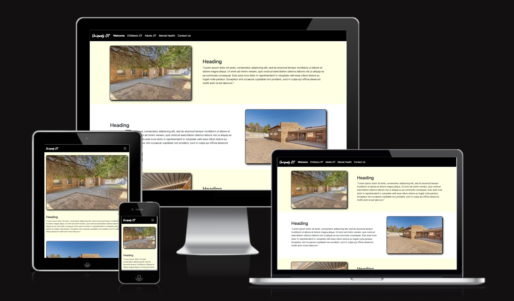
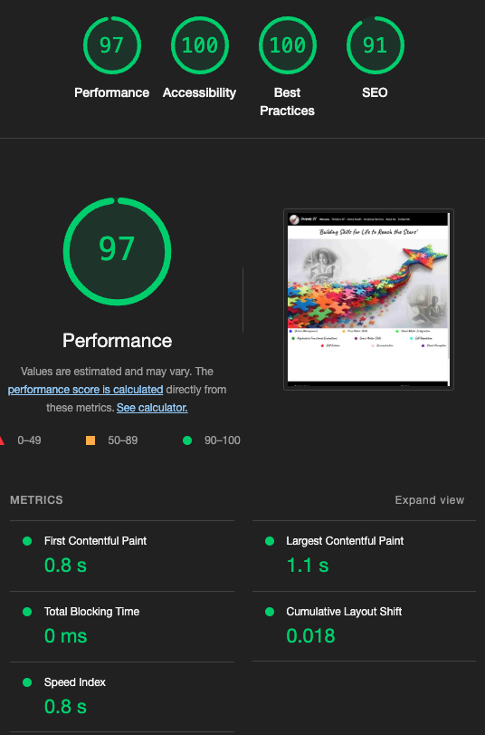

# Uniquely Occupational Therapy

A website build for an Occupational Therapy and Mental Health business based in South Africa. The code is subject to copyright and is not not to be used without the express permission of the author, 4uxdesign. The images are also subject to copyright and are
not to be used without the express permission of the author or the owner of the site.

The site has been built using HTML5, CSS3, Bootstrap5 and Javascript. The images used
are a combination of professional images, AI generated and free to use images from Unsplash and Freepik.

The site build has been regularly reviewed by the owner of the business and built to their specifications. 

## Performance and Testing

[amiresponsive](https://ui.dev/amiresponsive?url=https://thespamster.github.io/occupational_therapy/) - Demonstrates the responsiveness of the website across various screen sizes.

[Statcounter](https://statcounter.com/) - Stats for device screen sizes

Google Lighthouse Testing after deployment to Github pages.

## Deployment

Currently deployed to Github pages. Uses a custom domain. This means that 
I can easily manage the site for the owner post deployment.

## Technologies

[Bootstrap5.3](https://getbootstrap.com/) - CSS and Javascript library

[Bootstrap Icons](https://icons.getbootstrap.com/) - Free to use SVG icons

[convertio.co](https://convertio.co/) - convert images to webp format

[favicon.io](https://favicon.io/) - favicon image creator

[Google Fonts](https://fonts.google.com/) - Caveat and Roboto fonts

[EmailJS](https://www.emailjs.com/) - Send emails from your frontend. Has a free tier

## Acknowledgements

[Footer that sticks to bottom of content/screen](https://dev.to/nehalahmadkhan/how-to-make-footer-stick-to-bottom-of-web-page-3i14) - Thanks to Nehal Ahmad

[Flaticon](https://www.flaticon.com/) - Free icons from Freepik. Used during development as a placeholder image

[codingyaar](https://codingyaar.com/shorts/bootstrap-navbar-toggler-color-change/) - Change color of Bootstrap5 svg hamburger icon

[squarespace domains](https://domains.squarespace.com/) - A marketplace for custom
domains

[Unsplash](https://unsplash.com/) - The internet’s source for visuals. Powered by creators everywhere

[Freepik](https://www.freepik.com/) - High quality images

[Bing AI image creator](https://www.bing.com/images/create) - AI image creator