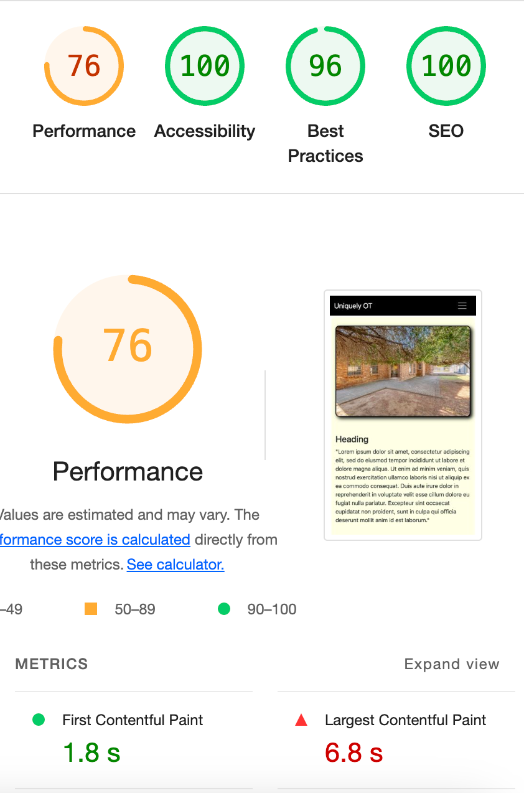

# Uniquely Occupational Therapy

** UNDER CONSTRUCTION **

A website build for an Occupational Therapy and Mental Health business based in South Africa.

## Performance and Testing

Initial Google Lighthouse Testing before optimisation.

## Technologies

[Bootstrap5.3](https://getbootstrap.com/) - CSS and Javascript library

[convertio.co](https://convertio.co/) - convert images to webp format

[favicon.io](https://favicon.io/) - favicon image creator

## Acknowledgements

[Footer that sticks to bottom of content/screen](https://dev.to/nehalahmadkhan/how-to-make-footer-stick-to-bottom-of-web-page-3i14) - Thanks to Nehal Ahmad

[Stackoverflow](https://stackoverflow.com/questions/71813422/how-would-i-make-a-transition-for-the-div-to-slide-to-the-left-and-come-out-thro) - Adapted to provide a single sliding div from right to left

[Flaticon](https://www.flaticon.com/) - Free icons from Freepik

[codingyaar](https://codingyaar.com/shorts/bootstrap-navbar-toggler-color-change/) - Change color of Bootstrap5 svg hamburger icon